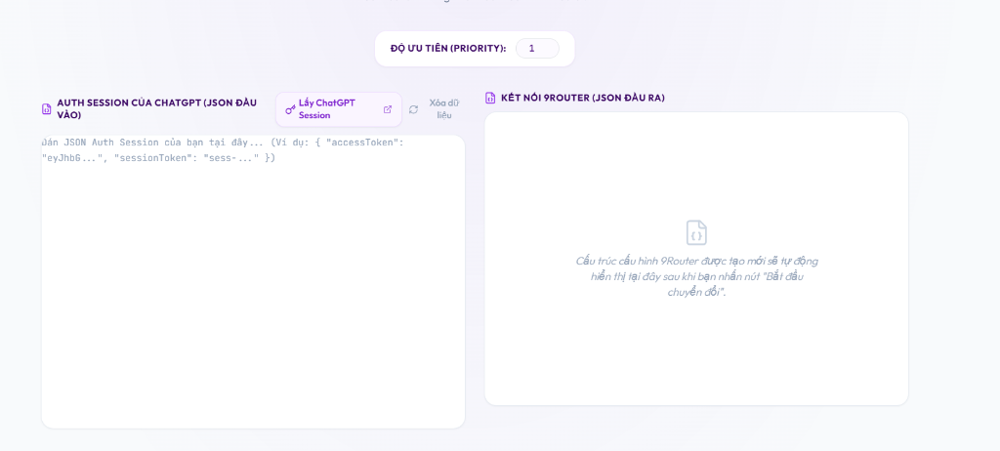
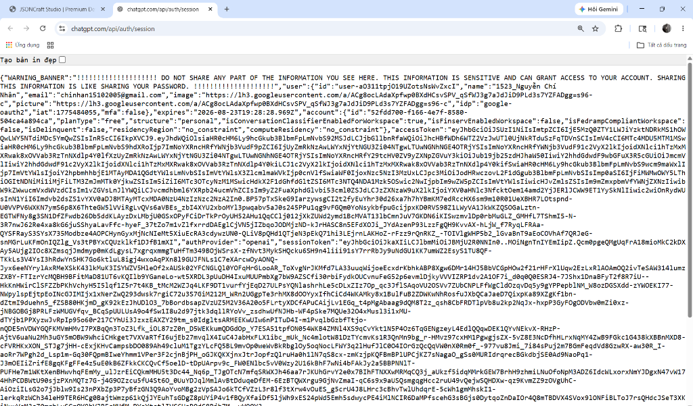
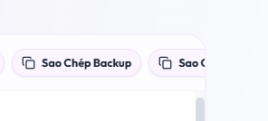

# 🚀 Trình Quản Lý & Chuyển Đổi Session 9Router Professional

<div align="center">

[](https://vitejs.dev/)
[](https://react.dev/)
[](https://www.typescriptlang.org/)
[](https://tailwindcss.com/)
[](#)

**Giải pháp chuyên nghiệp, an toàn và trực quan giúp quản lý, chuyển đổi ChatGPT Auth Session thành Codex Connection và gộp file sao lưu tự động cho 9Router.**

[Tính Năng Nổi Bật](#-tính-năng-nổi-bật) • [Hình Ảnh Minh Họa](#-hình-ảnh-minh-họa) • [Hướng Dẫn Sử Dụng](#-hướng-dẫn-sử-dụng) • [Cài Đặt Cục Bộ](#-cài-đặt-cục-bộ-local-development) • [An Toàn & Bảo Mật](#-an-toàn--bảo-mật)

</div>

---

## 📖 Giới Thiệu

**9Router** là một cổng định tuyến đa tài khoản mạnh mẽ. Để sử dụng tài khoản ChatGPT của bạn trên 9Router dưới dạng kết nối Codex, bạn cần chuyển đổi dữ liệu Session JSON của trình duyệt sang cấu trúc chính xác mà 9Router yêu cầu.

Tuy nhiên, một điểm bất tiện lớn của 9Router là khi bạn **nhập bản sao lưu mới**, nó sẽ **ghi đè và làm mất sạch các tài khoản đã nhập trước đó**. 

**9Router Session Converter & Manager** ra đời để giải quyết triệt để vấn đề này. Ứng dụng không chỉ chuyển đổi session sang định dạng Codex chuẩn mà còn tích hợp một **Thư viện Quản lý Tài khoản Cục bộ (LocalStorage)** mạnh mẽ, cho phép gộp tài khoản tự động từ file backup cũ, điều chỉnh độ ưu tiên, trạng thái hoạt động và xuất ra một file sao lưu duy nhất chứa đầy đủ tất cả tài khoản.

---

## 🎨 Hình Ảnh Minh Họa

Dưới đây là một số hình ảnh thực tế về giao diện trắng - tím sang trọng và các tính năng đột phá của ứng dụng:

### 🌟 1. Tổng Quan Giao Diện Trắng - Tím Premium
Giao diện được thiết kế hiện đại, cân đối, bo góc mềm mại với hiệu ứng chuyển động mượt mà và trực quan.


### 🔄 2. Chuyển Đổi & Phân Tích Thông Tin Tài Khoản
Sau khi dán JSON Session, hệ thống tự động phân tích ảnh đại diện, tên, email, gói tài khoản (Plus/Free) và hiển thị trực quan.


### 💻 3. Khung Code Tô Màu Cú Pháp (IDE-Style)
JSON đầu ra được tự động định dạng và tô màu cú pháp (chuỗi, số, boolean, null) chuyên nghiệp giống như một IDE thu nhỏ.


### 📦 4. Thư Viện Tài Khoản & Gộp File Backup Thông Minh
Quản lý tập trung tất cả tài khoản của bạn. Hỗ trợ nhập file backup cũ để tự động gộp mà không lo bị đè mất dữ liệu.


---

## ✨ Tính Năng Nổi Bật

- **🔄 Chuyển đổi session trong 1 nốt nhạc:** Phân tích cú pháp ChatGPT Auth Session phức tạp và chuyển đổi sang định dạng Codex chuẩn của 9Router trong tích tắc.
- **⚡ Nút Lấy ChatGPT Session tiện lợi:** Tích hợp liên kết mở nhanh trang API session của OpenAI giúp bạn sao chép nhanh JSON session chỉ với 1 click.
- **💾 Thư viện lưu trữ cục bộ (LocalStorage):** Đồng bộ tự động danh sách tài khoản của bạn trên trình duyệt web, đảm bảo không bị mất dữ liệu khi tải lại trang (F5).
- **➕ Cơ chế Gộp Backup thông minh:** Tải lên file backup cũ của bạn, hệ thống sẽ tự động gộp tất cả tài khoản cũ vào thư viện, tự động cập nhật token mới cho tài khoản trùng email.
- **🛠️ Chỉnh sửa nhanh trực quan:** Thay đổi **Độ ưu tiên (Priority)** từ 1 đến 5 hoặc bật/tắt **Trạng thái hoạt động (Active)** trực tiếp trên từng thẻ tài khoản trong thư viện.
- **📤 Xuất file sao lưu hợp nhất một chạm:** Xuất toàn bộ danh sách tài khoản đang quản lý thành một file sao lưu `.json` duy nhất để nạp vào 9Router một lần duy nhất.
- **🔔 Thông báo Toast mượt mà:** Tích hợp hệ thống thông báo trạng thái nổi (success, info, error) với hiệu ứng trượt góc phải chuyên nghiệp.
- **🔒 Bảo mật tuyệt đối 100%:** Toàn bộ quá trình xử lý, lưu trữ đều diễn ra cục bộ trong trình duyệt của bạn (Client-side). Không gửi bất kỳ dữ liệu nào lên server.

---

## 🚀 Hướng Dẫn Sử Dụng

### Bước 1: Lấy dữ liệu ChatGPT Session JSON
Đăng nhập tài khoản ChatGPT của bạn trên trình duyệt, sau đó nhấn nút **"Lấy ChatGPT Session"** ở phía trên cùng bên trái khung nhập liệu để mở nhanh trang session của OpenAI. Bôi đen và sao chép toàn bộ nội dung JSON hiển thị tại đó.

### Bước 2: Chuyển đổi tài khoản
Dán nội dung JSON session vào ô **"JSON Session ChatGPT"** bên trái và nhấn nút **"Bắt đầu chuyển đổi"** ở giữa.

### Bước 3: Lưu vào thư viện quản lý
* Nhấn nút **"Lưu Vào Danh Sách"** (màu xanh lá) ở trên khung kết quả để lưu tài khoản vào Thư viện phía dưới trình duyệt.
* *(Tùy chọn)* Nếu muốn tải riêng file backup chỉ chứa duy nhất tài khoản này, bạn có thể nhấn nút **"Tải File Riêng Lẻ"** (màu tím).

### Bước 4: Nhập và Gộp tài khoản cũ (Tùy chọn)
Nếu bạn có một file sao lưu cũ từ 9Router chứa các tài khoản đang hoạt động, hãy nhấn nút **"Nhập File Backup Cũ"** tại khu vực Thư viện để nạp toàn bộ các tài khoản cũ đó vào danh sách quản lý.

### Bước 5: Xuất file sao lưu cuối cùng
Kiểm tra danh sách tài khoản tại Thư viện phía dưới, tinh chỉnh độ ưu tiên nếu muốn, sau đó nhấn **"Xuất File Sao Lưu Toàn Bộ"** để tải về file cấu hình gộp cuối cùng. Nạp file này vào 9Router của bạn để kích hoạt toàn bộ tài khoản cùng một lúc!

---

## 🛠️ Cài Đặt Cục Bộ (Local Development)

Yêu cầu máy tính của bạn đã cài đặt [Node.js](https://nodejs.org/) (khuyên dùng phiên bản v18 trở lên).

### 1. Tải mã nguồn về máy
```bash
git clone https://github.com/chinhanxt/-Session-9Router.git
cd -Session-9Router
```

### 2. Cài đặt các thư viện phụ thuộc
```bash
npm install
```

### 3. Khởi chạy máy chủ phát triển (Development Server)
```bash
npm run dev
```
Ứng dụng sẽ chạy tại địa chỉ: [http://localhost:5173/](http://localhost:5173/)

### 4. Biên dịch cho môi trường Production
```bash
npm run build
```
Lệnh này sẽ tối ưu hóa và xuất mã nguồn sạch ra thư mục `dist` để sẵn sàng triển khai lên Github Pages hoặc bất kỳ hosting tĩnh nào.

---

## 🔒 An Toàn & Bảo Mật

Bảo mật thông tin khóa truy cập của bạn là ưu tiên hàng đầu của chúng tôi:
* **Xử lý phía Client-side 100%:** Mọi hoạt động phân tích cú pháp, sinh mã UUID ngẫu nhiên, gộp dữ liệu sao lưu đều chạy trực tiếp trên RAM trình duyệt của bạn.
* **Không giao tiếp bên ngoài:** Trang web hoàn toàn không có API kết nối cơ sở dữ liệu từ xa hay gửi dữ liệu của bạn đi bất cứ đâu. Dữ liệu của bạn thuộc về bạn.
* **Mã nguồn mở hoàn toàn:** Bạn có thể tự kiểm chứng mức độ an toàn bằng cách đọc mã nguồn chính tại tệp `src/App.tsx`.

---

## 📄 Giấy Phép (License)

Dự án này được cấp phép theo các điều khoản của [MIT License](LICENSE). Bạn hoàn toàn có quyền sử dụng, sửa đổi và phân phối lại mã nguồn này một cách tự do.
